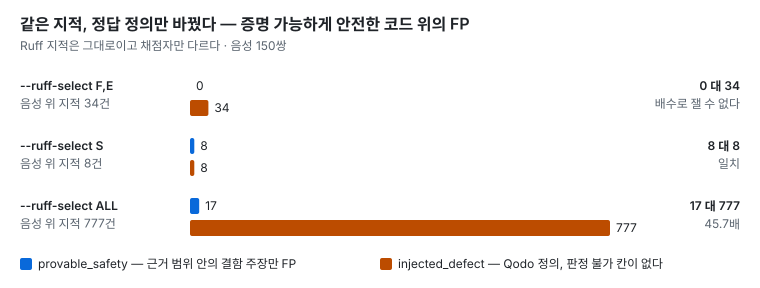

# CodeProof AI

[](https://github.com/manners-parkpro/codeproof-ai/actions/workflows/ci.yml)

**코드리뷰 품질 측정 실험 플랫폼** — 리뷰어를 비교하는 대신, **측정 방식이 결과를 얼마나 만드는지**를 측정한다.

실무 Spring 백엔드에서 Codex 와 Claude 를 매일 쓰다가 생긴 질문, 「AI 리뷰어가 내는 품질 숫자를 얼마나 믿을 수 있나」를
직접 재 본 프로젝트다. 이 저장소도 AI 에이전트와 함께 만들었다 ([아래](#ai-에이전트와-만든-방식)).
그림으로 보는 한 페이지: <https://manners-parkpro.github.io/codeproof-ai/>

> **상태** — 정적분석기(Ruff · mypy)와 에이전트 층(Claude Code · Codex CLI, 목표 150쌍 · 각 3회) 측정을 마쳤다.
> 모델 API 층은 어댑터만 있고 아직 재지 않았다.
> 현재 숫자는 생성물 [docs/MEASUREMENTS.md](docs/MEASUREMENTS.md) 에 있다. 진행 중: Codex 가 쓴 쌍으로 같은 비교를
> 다시 한다 ([DESIGN §7.10d](docs/DESIGN.md)).

## 30초 요약

증명 가능하게 안전한 코드(decoy)와 가드만 지운 짝(twin)을 쌍으로 만들어 Ruff 를 돌리고, **같은 지적을** 서로 다른
정답 정의로 채점했다.
**지적은 하나도 바뀌지 않았다. 정의만 바꿨다** [실측 · 150쌍].



- `--ruff-select ALL` 에서 FP 가 **17 대 777 — 45.7배** [실측 · 150쌍]. 짝 판정도 갈린다 — 같은 실행을 `provable_safety` 는
  「거의 다 놓쳤다」, `injected_defect` 는 「거꾸로 찾았다」고 판정하고, 그 「거꾸로」도 매칭 허용 오차를 2줄 넓히면
  「둘 다 지적했다」로 바뀐다 (결과 3).
- 🔴 이 편차도 손잡이의 함수다 — 보안 룰만 고르면(`--ruff-select S`) 두 정의가 **정확히 일치한다** (결과 6).
- 에이전트도 같은 하네스로 잰다 — claude − codex 차이가 claude 쪽으로 구별됐다. 같은 프롬프트 하나 · Claude 가 쓴 쌍 ·
  effort low 라는 조건이 붙고, 도구 · 권한이 제품마다 달라 차이에는 모델과 제품이 함께 들어 있다 (결과 7 · 한계 6 · 7).

그림은 `uv run codeproof report` 가 만드는 생성물이고, 이 글의 숫자는 테스트가 그 생성물과 견준다.

## 받아서 돌려 보기 — API 키 없이

필요한 것은 git 과 [uv](https://docs.astral.sh/uv/) 뿐이다 (Python 3.14 는 uv 가 받는다).

```bash
git clone https://github.com/manners-parkpro/codeproof-ai.git
cd codeproof-ai
uv sync
uv run pytest           # 전체 테스트
./scripts/verify.sh     # 주장이 이 기계에서 재현되는지 · 가드가 공허하지 않은지 — 안 되면 exit 1
```

소요는 기계마다 다르다 — 개발 기기와 macOS 러너에서 pytest 3~4분 · `verify.sh` 약 6분, Linux 러너에서는 각각 15분
안팎이다 [실측 · 2026-10-07 · CI 기록]. 같은 검사를 GitHub Actions 가 PR 마다
Linux · macOS 새 환경에서 돈다 ([실행 기록](https://github.com/manners-parkpro/codeproof-ai/actions/workflows/ci.yml)).
공백이 든 경로와 빈 홈 디렉터리에서도 통과했다 [실측 · 2026-10-07]. Windows 는 확인하지 않았다.
주장을 직접 무너뜨려 보는 절차는 [docs/VERIFY.md](docs/VERIFY.md) 에 있다.

## AI 에이전트와 만든 방식

PR 병합 커밋을 뺀 모든 커밋을 Claude Code 와 함께 썼다 [실측 · 2026-10-07 · `git log --no-merges` 의 공동 작성자 표시].

- **확인 수단을 먼저 준다** — 에이전트가 스스로 돌리는 테스트 · 반증 시나리오 · `verify.sh` 로 일이 통과 · 실패로 끝난다.
- **사람은 기준과 경계를 정한다** — 무엇을 재고 주장하지 않을지, 측정 절차(데이터를 보기 전에), push · 병합 · 유료 실행처럼
  되돌릴 수 없는 일. 구현 · 테스트 · 실행은 에이전트가 한다.
- **꼭 지켜야 하는 규칙은 코드로 강제한다** — 작업 규칙([CLAUDE.md](CLAUDE.md))은 권고라 문서에만 적은 규칙은 지켜지지 않았다
  → 테스트 · 편집 훅.
- **쓴 쪽이 채점하지 않는다** — 다른 문맥의 독립 검토와 다른 모델 패밀리(Codex)의 감사가 라벨을 다시 본다.

Claude Code 공식 best practice 와 같은 구조다 [소스: [Best practices for Claude Code](https://code.claude.com/docs/en/best-practices)].

에이전트와 쓴 코드가 테스트가 초록인 채로 틀린 자리와 그것을 잡은 방법은 [docs/AI-WORKFLOW.md](docs/AI-WORKFLOW.md) 에 있다.

## 결과

API 키 없이 다시 나온다 — 결과 1~3 · 5 · 6 은 `uv run codeproof measure` · `uv run codeproof report`, 결과 4 는
`uv run pytest tests/verify/test_verifiers.py`, 결과 7 은 저장소에 실린 원본 지적을 `report` 가 다시 채점한다.
표와 근거는 [docs/RESULTS.md](docs/RESULTS.md).

1. **결과 1** — 안전한 코드와 터지는 코드를 구별하지 못한다. 같은 룰 · 같은 줄 · 같은 판정이 양쪽에 나온다.
2. **결과 2** — 같은 지적을 여러 정의로 채점하면 FP 가 크게 갈린다 — `--ruff-select ALL` 에서 17 대 777 (위 30초 요약).
3. **결과 3** — 짝 판정도 채점자의 함수다. 같은 실행이 정의마다 「놓쳤다」와 「거꾸로 찾았다」로 갈리고, 그 「거꾸로」는
   매칭 허용 오차에 흔들린다. 철회 기록도 여기 있다.
4. **결과 4** — 검증 레이어(인용 · 가드 · 교차 확인 · 도달성)는 쌍에 따라 갈린다 — 두 사례에서 제어흐름 가드는 찾았고
   데이터흐름 가드는 못 봤다.
5. **결과 5** — 판정이 매칭 허용 오차(slack)에 흔들린다. 그래서 사다리로 바꿔 가며 같이 낸다.
6. **결과 6** — 룰 선택이 FP 도, 정의 간 편차도 움직인다. `S` 로 좁히면 두 정의가 8 대 8 로 일치한다 [실측 · 150쌍].
7. **결과 7** — 에이전트 층: 수집 전에 선언한 주 지표로 claude − codex 차이가 claude 쪽으로 구별됐고, 매칭 사다리 전체에서
   판정이 같았다 [실측 · 150쌍 · 생성물]. effort low 이고, 차이에는 모델과 제품(도구 · 권한)이 함께 들어 있다.

## 왜 이 숫자를 믿을 수 있나

- **리뷰어는 한 가지 개념이다** — 정적분석기 · 에이전트 · 가져온 SARIF · 사람이 같은 하네스로 돌고 같은 채점을 받는다.
  층이 다르면 섞어 집계하지 않는다.
- **라벨은 실행으로 반증한다** — 쌍마다 `proof.py` 가 `attack(decoy) is False` · `attack(twin) is True` 를 보인다.
- **판정 불가는 1급 판정이다** — 「아무도 지적하지 않았다」를 「틀렸다」로 세지 않고, 판정불가율을 같이 낸다.
- **구조가 막는다** — 런타임 레이어는 정답 라벨을 import 할 수 없고, 매니페스트 없는 결과는 데이터베이스가 받지 않는다.
- **숨은 손잡이를 공개한다** — 룰 선택 · 매칭 허용 오차 · effort · 캐시 · 프롬프트 · 코퍼스 구성비를 실행 기록에 싣는다.
- **주 지표에 LLM 판정자를 쓰지 않는다** — 자기선호 편향이 Claude vs Codex 비교를 무효화한다.
- **가드는 깨뜨려 본 뒤에만 있다고 말한다** — [`scripts/falsify.sh`](scripts/falsify.sh) 가 불변식을 일부러 깨고 테스트가 우는지 본다.

## 재지 못하는 것

자세한 이유는 [docs/RESULTS.md](docs/RESULTS.md).

1. **한계 1** — 결함 탐지는 리뷰의 1/8 이다 — 실제 리뷰 코멘트 중 결함 지적은 14% 다
   ([Bacchelli & Bird](https://sback.it/publications/icse2013.pdf)).
2. **한계 2** — 정답과 일치하는 것과 유용한 것은 다르다.
3. **한계 3** — 50:50 세트의 precision 은 프로덕션 precision 이 아니다 → 양성 층이 생기면 `(TPR, FPR)` 로 보고한다.
4. **한계 4** — 오염 내성은 층마다 다르다 — 직접 만든 층(변이 주입 · decoy)은 면역이고, 공개 PR 에서 캔 층은 아니다.
5. **한계 5** — 변이 주입 층은 현실적이지 않다 → recall 바닥선으로만 쓴다.
6. **한계 6** — 안전한 쪽 정답(decoy)과 측정 뒤 재판정을 측정 대상 한쪽과 같은 패밀리(Claude)가 했다 — 틀린 라벨이 남으면
   claude 쪽으로 기운다. 그래서 Codex 가 쓴 쌍으로 다시 잰다 ([DESIGN §7.10d](docs/DESIGN.md)).
7. **한계 7** — 에이전트 비교는 같은 프롬프트 하나 위의 차이다 — 다른 프롬프트에서 같은 차이가 나는지는 재지 않았다.

## 기술 스택

| 영역 | 선택 |
|---|---|
| 런타임 | Python ≥3.14 · uv |
| 정적분석 | Ruff · mypy — subprocess · 호스트 설정과 캐시를 격리 |
| LLM | `anthropic` · `openai` SDK 직접 — 래퍼 없음 (토큰 정의가 벤더마다 다르다) |
| 저장 | SQLite — 매니페스트 없는 결과를 외래키가 거부한다 |
| 가져오기 | SARIF 2.1.0 · bandit JSON · 에이전트 JSON |

선택 이유는 [docs/RESULTS.md](docs/RESULTS.md), 구조와 레이어 규칙은 [DESIGN §6](docs/DESIGN.md).

## 문서

| 문서 | 내용 |
|---|---|
| [docs/RESULTS.md](docs/RESULTS.md) | 결과 · 근거 · 한계의 자세한 판 · 명령 모음 · 참고문헌 |
| [docs/AI-WORKFLOW.md](docs/AI-WORKFLOW.md) | AI 에이전트와 일한 방식 — 출발점 · 맡긴 것과 정한 것 · 조용히 틀린 자리 |
| [docs/VERIFY.md](docs/VERIFY.md) | 검증 프로토콜 — 이 주장들을 직접 무너뜨리는 법 |
| [docs/MEASUREMENTS.md](docs/MEASUREMENTS.md) | 현재 수치 (생성물 — 손으로 고치지 않는다) |
| [docs/DESIGN.md](docs/DESIGN.md) | 설계 근거 · 사전 선언 · 바뀐 것과 교훈 |
| [CLAUDE.md](CLAUDE.md) | 에이전트에게 주는 작업 규칙 · 불변식 (세션마다 다시 읽힌다) |

## 라이선스와 데이터 윤리

- 지금 코퍼스는 직접 쓴 decoy 쌍이다 — 저장소에 들어 있다.
- 실제 레포 마이닝은 v2 계획이다. 하게 되면 대상은 **MIT / BSD / Apache-2.0 레포로 한정**하고, 배포물은
  `(repo, SHA, path, line range)` + 자체 라벨 + **재구성 스크립트**로 한다 — 소스 코드를 번들하지 않는다
  (Defects4J · SWE-bench 와 같은 방식).
- GitHub AUP 의 연구 예외는 **결과물이 open access 일 것**을 요구한다.
